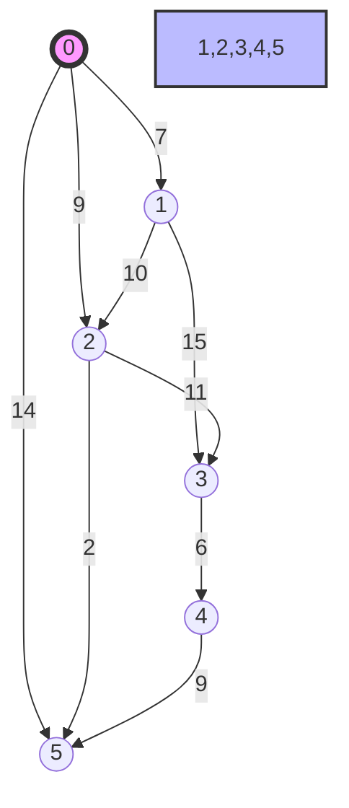
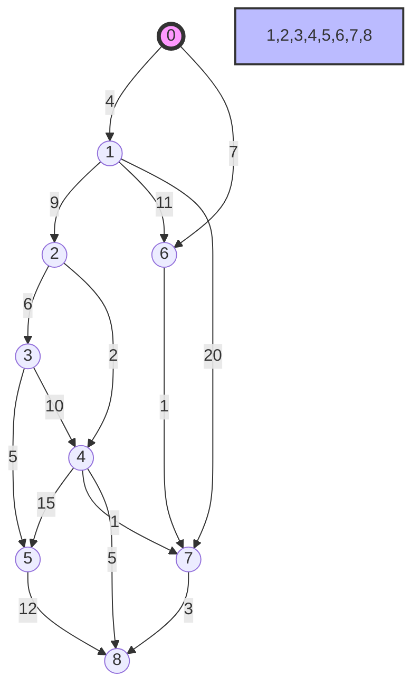
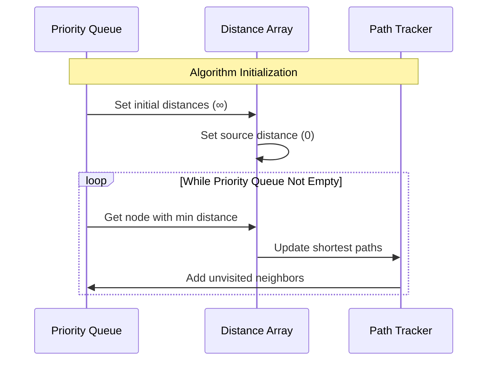

# Dijkstra's Algorithm: Comparative Analysis

## Graph Structures

### Example 1 (Original Graph)


### Example 2 (Extended Graph)


## Algorithm Processing Steps



## Detailed Analysis for Example 1 (0 to 5)

```mermaid
sequenceDiagram
    participant Start as Start(0)
    participant Process as Processing
    participant End as End(5)
    
    Note over Start: Initial state
    Start->>Process: Distance[0] = 0
    Note over Process: Visit node 0
    Process->>Process: Update neighbors
    Note right of Process: 1: min(∞, 7) = 7
    Note right of Process: 2: min(∞, 9) = 9
    Note right of Process: 5: min(∞, 14) = 14
    
    Process->>Process: Visit node 1
    Note right of Process: 2: min(9, 7+10) = 9
    Note right of Process: 3: min(∞, 7+15) = 22
    
    Process->>Process: Visit node 2
    Note right of Process: 5: min(14, 9+2) = 11
    
    Process->>End: Final shortest path
    Note over End: Distance[5] = 11
```

## Detailed Analysis for Example 2 (0 to 8)

```mermaid
sequenceDiagram
    participant Start as Start(0)
    participant Process as Processing
    participant End as End(8)
    
    Note over Start: Initial state
    Start->>Process: Distance[0] = 0
    Note over Process: Visit node 0
    Process->>Process: Update neighbors
    Note right of Process: 1: min(∞, 4) = 4
    Note right of Process: 6: min(∞, 7) = 7
    
    Process->>Process: Visit node 1
    Note right of Process: 2: min(∞, 4+9) = 13
    Note right of Process: 6: min(7, 4+11) = 7
    Note right of Process: 7: min(∞, 4+20) = 24
    
    Process->>Process: Visit node 6
    Note right of Process: 7: min(24, 7+1) = 8
    
    Process->>Process: Visit node 7
    Note right of Process: 8: min(∞, 8+3) = 11
    
    Process->>End: Final shortest path
    Note over End: Distance[8] = 11
```

## Key Findings

1. Example 1 (0 to 5):
   - Shortest path: 0 → 2 → 5
   - Total distance: 11 units
   - Key decision point: Choosing path through node 2 instead of direct path (14)

2. Example 2 (0 to 8):
   - Shortest path: 0 → 6 → 7 → 8
   - Total distance: 11 units
   - Key decision point: Using path through nodes 6 and 7 instead of longer alternatives

## Implementation Considerations

- Priority Queue maintenance is crucial for efficiency
- Path reconstruction requires tracking previous nodes
- Edge relaxation determines optimal path selection
- Time complexity: O((V + E) log V) with binary heap
- Space complexity: O(V + E) with adjacency list

Would you like me to elaborate on any specific part of this analysis or focus on a particular path finding scenario in either graph?</antArtifact>