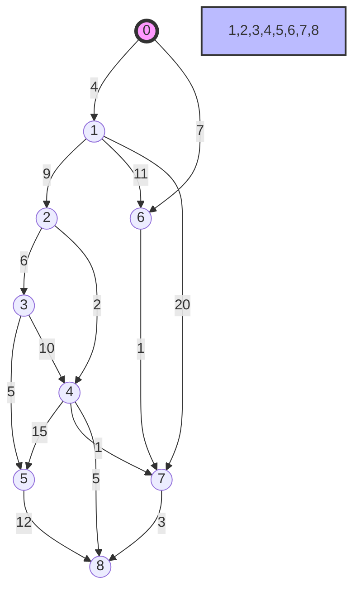
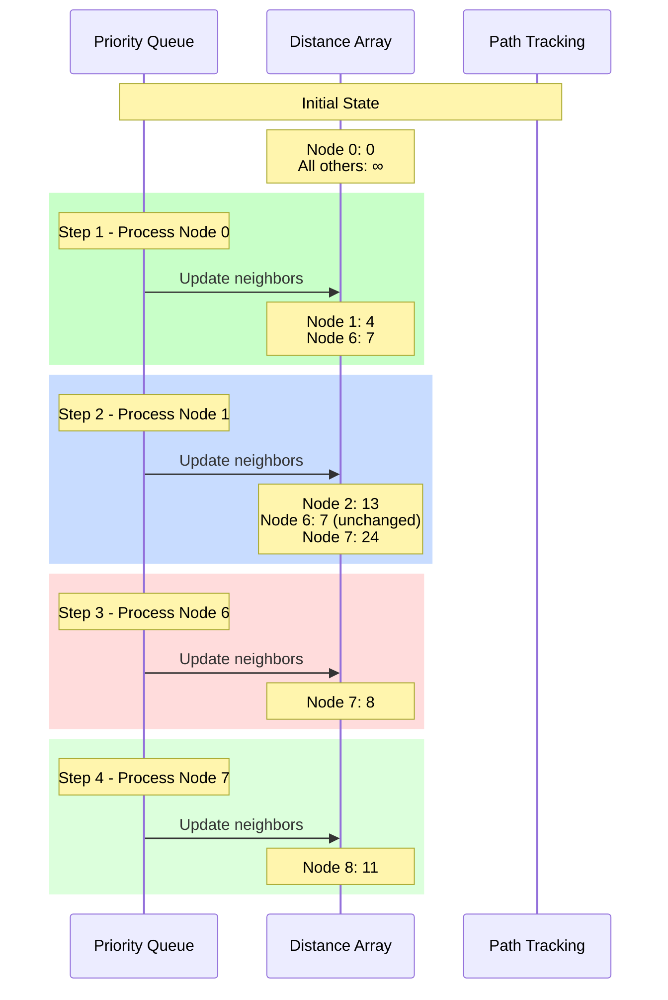
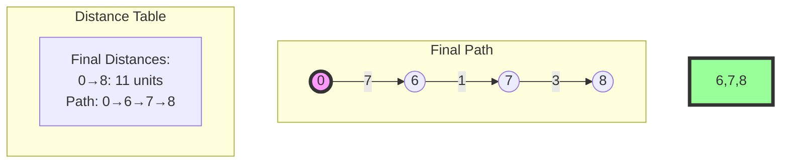
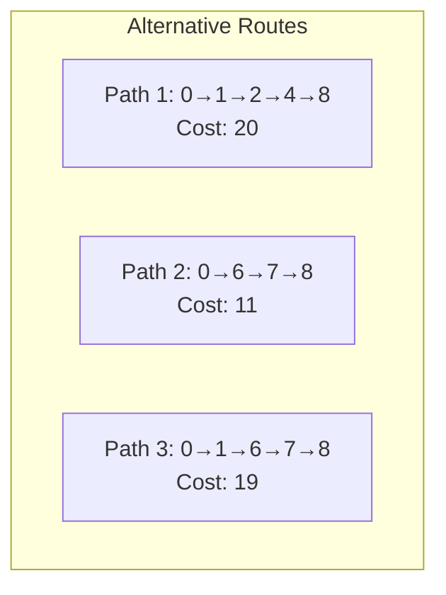

# Comprehensive Guide to Dijkstra's Algorithm with Case Study

## 1. Practical Example
Consider the following weighted graph:



### Sample Path Analysis: 0 to 8
Let's trace how Dijkstra's algorithm finds the shortest path from node 0 to node 8.



### Shortest Path Discovery


## 2. Algorithm Implementation for Example

```java
public class DijkstraExample {
    public static Map<Integer, Integer> findShortestPath(WeightedGraph graph, int start) {
        Map<Integer, Integer> distances = new HashMap<>();
        PriorityQueue<Node> pq = new PriorityQueue<>(
            (a, b) -> distances.get(a) - distances.get(b)
        );
        
        // Initialize distances
        for (int node = 0; node < 9; node++) {
            distances.put(node, Integer.MAX_VALUE);
        }
        distances.put(start, 0);
        pq.offer(new Node(start));

        while (!pq.isEmpty()) {
            Node current = pq.poll();
            
            for (Edge edge : graph.getEdges(current.id)) {
                int newDist = distances.get(current.id) + edge.weight;
                if (newDist < distances.get(edge.dest)) {
                    distances.put(edge.dest, newDist);
                    pq.offer(new Node(edge.dest));
                }
            }
        }
        return distances;
    }
}
```

## 3. Step-by-Step Path Discovery

### Key Decision Points in Example Graph:
1. Initial Choice at Node 0:
   - Option 1: 0→1 (weight: 4)
   - Option 2: 0→6 (weight: 7) ✓

2. From Node 6:
   - Direct path to 7 (weight: 1) ✓

3. From Node 7:
   - Direct path to 8 (weight: 3) ✓

### Alternative Paths Analysis:


## 4. Implementation Details

### Priority Queue State Transitions
```java
// Example progression of priority queue states
Step 1: [(0,0)]
Step 2: [(1,4), (6,7)]
Step 3: [(6,7), (2,13), (7,24)]
Step 4: [(7,8), (2,13)]
Step 5: [(8,11), (2,13)]
```

### Path Tracking
```java
Map<Integer, Integer> previousNodes = new HashMap<>();
// After algorithm completion:
// 8 → 7 → 6 → 0
```

This practical example demonstrates how Dijkstra's algorithm:
1. Always selects the minimum current distance node
2. Updates distances through edge relaxation
3. Maintains an optimal substructure
4. Guarantees the shortest path upon completion

Would you like me to elaborate on any particular aspect of this example or explain the decision-making process at any specific node?</antArtifact>