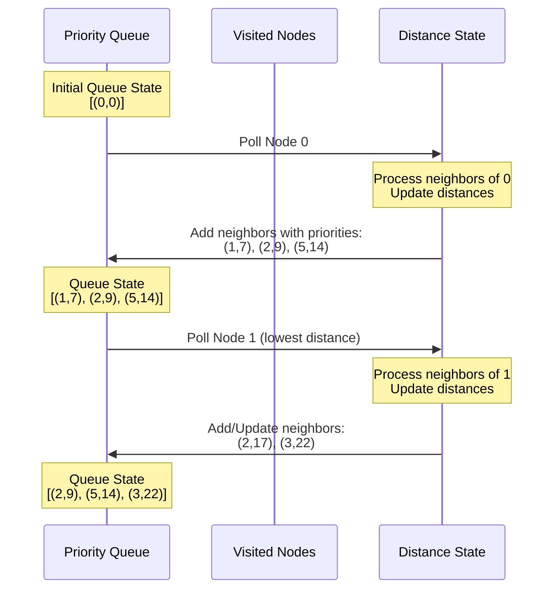
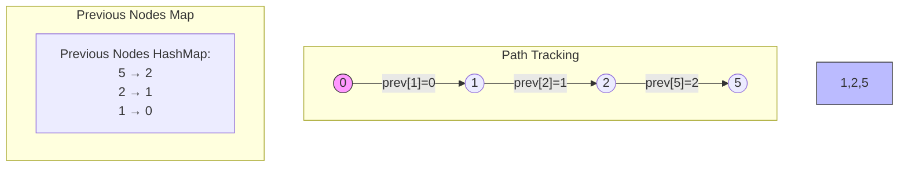
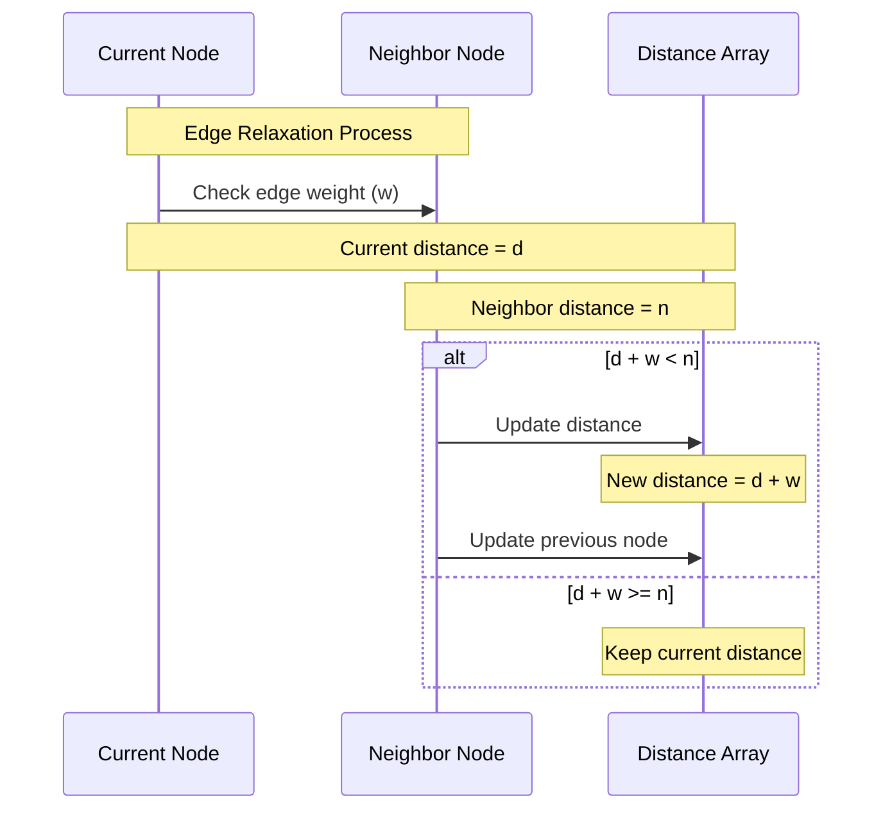

## 1. Priority Queue Maintenance



### Priority Queue Efficiency:
1. Binary Heap Implementation
```java
PriorityQueue<Node> pq = new PriorityQueue<>((a, b) -> 
    distances.get(a) - distances.get(b));
```

2. Key Operations:
```java
// O(log n) insertion
pq.offer(new Node(vertex, distance));

// O(log n) removal of minimum element
Node current = pq.poll();

// O(1) peek at minimum element
Node next = pq.peek();
```

## 2. Path Reconstruction



### Path Tracking Implementation:
```java
private Map<Node, Node> previousNodes = new HashMap<>();

private void trackPath(Node current, Node neighbor, int newDistance) {
    if (newDistance < distances.get(neighbor)) {
        distances.put(neighbor, newDistance);
        previousNodes.put(neighbor, current);  // Track the path
    }
}

private List<Node> reconstructPath(Node destination) {
    List<Node> path = new ArrayList<>();
    Node current = destination;
    
    while (current != null) {
        path.add(0, current);  // Add to front of list
        current = previousNodes.get(current);  // Move to previous node
    }
    return path;
}
```

## 3. Edge Relaxation



### Edge Relaxation Implementation:
```java
private void relaxEdge(Node current, Node neighbor, int weight) {
    int currentDistance = distances.get(current);
    int neighborDistance = distances.get(neighbor);
    int newDistance = currentDistance + weight;
    
    if (newDistance < neighborDistance) {
        // Update distance
        distances.put(neighbor, newDistance);
        // Update previous node
        previousNodes.put(neighbor, current);
        // Add to priority queue with new priority
        pq.offer(neighbor);
    }
}
```

## Combined Process Example

```mermaid
graph TD
    subgraph Processing State
        PQ[Priority Queue<br/>Current: (2,9)]
        DM[Distance Map<br/>0:0, 1:7, 2:9, 3:∞, 4:∞, 5:14]
        PM[Previous Map<br/>1←0, 2←0, 5←0]
    end
    
    subgraph Edge Relaxation
        direction LR
        C((Current: 2)) -->|"weight=2"| N((Neighbor: 5))
        Note["Old distance to 5: 14<br/>New possible distance: 11<br/>11 < 14, so update"]
    end
    
    subgraph Updated State
        PQ2[Priority Queue<br/>Next: (5,11)]
        DM2[Distance Map<br/>0:0, 1:7, 2:9, 3:∞, 4:∞, 5:11]
        PM2[Previous Map<br/>1←0, 2←0, 5←2]
    end
```

### Key Optimizations:

1. **Priority Queue Management**
   - Maintain heap property after every update
   - Only add nodes when their distance improves
   - Use decrease-key operation when available

2. **Path Tracking**
   - Only update previous node when finding shorter path
   - Store only essential path information
   - Reconstruct path only when needed

3. **Edge Relaxation**
   - Process each edge at most once
   - Early termination when possible
   - Skip relaxation if current node's distance is infinity