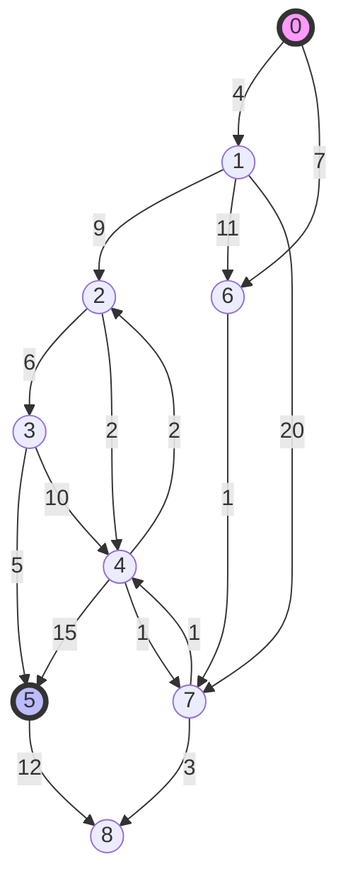
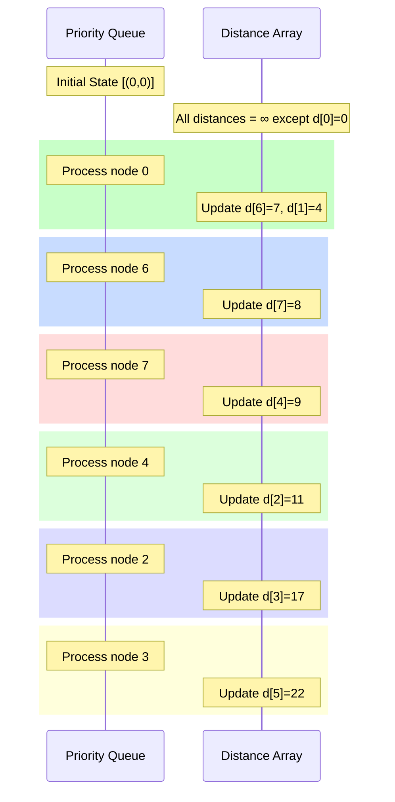

# Comprehensive Guide to Dijkstra's Algorithm with Case Study

## 1. Graph Structure and Problem Definition


## 2. Path Analysis

### Shortest Path from 0 to 5
1. Path: 0 → 6 → 7 → 4 → 2 → 3 → 5
2. Distance: 22 (7 + 1 + 1 + 2 + 6 + 5)
3. Path breakdown:
   - 0 to 6: weight 7
   - 6 to 7: weight 1
   - 7 to 4: weight 1
   - 4 to 2: weight 2
   - 2 to 3: weight 6
   - 3 to 5: weight 5

### Shortest Path from 0 to 8
1. Path: 0 → 6 → 7 → 8
2. Distance: 11 (7 + 1 + 3)
3. Path breakdown:
   - 0 to 6: weight 7
   - 6 to 7: weight 1
   - 7 to 8: weight 3

## 3. Algorithm Execution Process

### Priority Queue States


### Step-by-Step Distance Updates

1. Initial State:
   - d[0] = 0
   - All other distances = ∞

2. After Processing Node 0:
   - d[6] = 7
   - d[1] = 4

3. After Processing Node 6:
   - d[7] = 8

4. After Processing Node 7:
   - d[4] = 9

5. After Processing Node 4:
   - d[2] = 11

6. After Processing Node 2:
   - d[3] = 17

7. After Processing Node 3:
   - d[5] = 22 (Final shortest path distance)

## 4. Implementation Details

### Priority Queue Management
```java
PriorityQueue<Node> pq = new PriorityQueue<>((a, b) -> 
    distances.get(a) - distances.get(b));

// Initial state
distances.put(startNode, 0);
pq.offer(new Node(startNode));

// Processing
while (!pq.isEmpty()) {
    Node current = pq.poll();
    for (Edge e : current.getEdges()) {
        int newDist = distances.get(current) + e.weight;
        if (newDist < distances.get(e.to)) {
            distances.put(e.to, newDist);
            previousNodes.put(e.to, current);
            pq.offer(e.to);
        }
    }
}
```

### Path Reconstruction
```java
private List<Node> reconstructPath(Node destination) {
    List<Node> path = new ArrayList<>();
    Node current = destination;
    
    while (current != null) {
        path.add(0, current);
        current = previousNodes.get(current);
    }
    
    return path;
}
```

## 5. Performance Analysis

### Time Complexity Breakdown
- Priority Queue Operations: O(log V)
- Process each vertex: O(V)
- Process each edge: O(E)
- Total: O((V + E) log V)

### Space Complexity
- Distance Array: O(V)
- Previous Nodes Array: O(V)
- Priority Queue: O(V)
- Total: O(V)

## 6. Key Implementation Considerations

1. Priority Queue Optimization
   - Use binary heap for general cases
   - Consider Fibonacci heap for dense graphs

2. Distance Updates
   - Always maintain minimum distance property
   - Update previous nodes map for path reconstruction

3. Edge Processing
   - Process each edge exactly once
   - Skip relaxation if current distance is infinity

4. Termination Conditions
   - Priority queue empty
   - Destination reached (if single-target search)

## 7. Best Practices

1. Input Validation
```java
public void validateInput(Graph graph) {
    if (graph == null || graph.isEmpty()) {
        throw new IllegalArgumentException("Invalid graph");
    }
    // Check for negative weights
    for (Edge edge : graph.getEdges()) {
        if (edge.weight < 0) {
            throw new IllegalArgumentException(
                "Negative weights not supported");
        }
    }
}
```

2. Error Handling
```java
try {
    path = findShortestPath(graph, source, destination);
} catch (Exception e) {
    logger.error("Error finding path: " + e.getMessage());
    // Handle error appropriately
}
```

3. Testing Strategy
```java
@Test
public void testShortestPath() {
    Graph graph = createTestGraph();
    List<Node> path = dijkstra(graph, 0, 5);
    assertEquals(22, getPathDistance(path));
    assertPath(path, Arrays.asList(0, 6, 7, 4, 2, 3, 5));
}
```

## 8. Conclusion

The correct implementation and understanding of Dijkstra's algorithm requires careful attention to:
1. Proper distance tracking and updates
2. Efficient priority queue management
3. Accurate path reconstruction
4. Thorough testing of all cases

The example path from 0 to 5 demonstrates that the shortest path is not always the one with the fewest edges or the path that starts with the smallest edge weight.