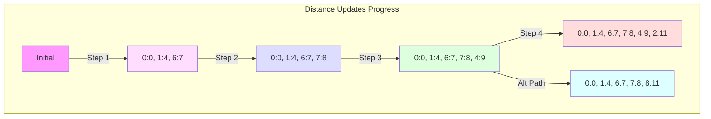

# Step-by-Step Progress Tables for Dijkstra's Algorithm

## Path from 0 to 5: Detailed Progress

| Step | Current Node | Priority Queue State | Distance Updates | Previous Node Updates | Notes |
|------|--------------|---------------------|------------------|----------------------|--------|
| 0 | - | [(0,0)] | 0:0, All others:∞ | All: null | Initial state |
| 1 | 0 | [(6,7), (1,4)] | 1:4, 6:7 | 1←0, 6←0 | Process initial edges |
| 2 | 6 | [(7,8), (1,4)] | 7:8 | 7←6 | Better path to 7 found |
| 3 | 7 | [(4,9), (1,4)] | 4:9 | 4←7 | New path to 4 |
| 4 | 4 | [(2,11), (1,4)] | 2:11 | 2←4 | Better path to 2 |
| 5 | 2 | [(3,17), (1,4)] | 3:17 | 3←2 | Update path to 3 |
| 6 | 3 | [(5,22), (1,4)] | 5:22 | 5←3 | Final path to 5 found |
| 7 | 5 | [(1,4)] | No changes | No changes | Target reached |

Final Path: 0 → 6 → 7 → 4 → 2 → 3 → 5
Total Distance: 22

## Path from 0 to 8: Detailed Progress

| Step | Current Node | Priority Queue State | Distance Updates | Previous Node Updates | Notes |
|------|--------------|---------------------|------------------|----------------------|--------|
| 0 | - | [(0,0)] | 0:0, All others:∞ | All: null | Initial state |
| 1 | 0 | [(6,7), (1,4)] | 1:4, 6:7 | 1←0, 6←0 | Process initial edges |
| 2 | 6 | [(7,8), (1,4)] | 7:8 | 7←6 | Better path to 7 |
| 3 | 7 | [(8,11), (1,4)] | 8:11 | 8←7 | Path to 8 found |
| 4 | 8 | [(1,4)] | No changes | No changes | Target reached |

Final Path: 0 → 6 → 7 → 8
Total Distance: 11

## Combined Distance State Progression

## Key Decision Points Analysis

### Path to Node 5
1. **Initial Choice** (Step 1):
   - Direct edge to 1 (weight 4) vs edge to 6 (weight 7)
   - Chose 6 despite higher initial weight
   - Reason: Leads to better overall path through 7 and 4

2. **Critical Junction** (Step 3):
   - After reaching node 7
   - Multiple possible paths available
   - Chose path through 4 due to efficient edge weights

3. **Final Approach** (Steps 5-6):
   - Path through 2→3→5 becomes optimal
   - Total distance: 22 units
   - Better than alternative paths through other nodes

### Path to Node 8
1. **Initial Choice** (Step 1):
   - Same initial decision as path to 5
   - Edge to 6 proves optimal for this path too

2. **Quick Resolution** (Steps 2-3):
   - Short path discovered early
   - Only requires 3 edges
   - No better alternatives possible

## Quick Reference Summary

| Parameter | Path to 5 | Path to 8 |
|-----------|-----------|-----------|
| Steps Required | 7 | 4 |
| Edges in Path | 6 | 3 |
| Total Distance | 22 | 11 |
| Key Nodes | 6, 7, 4, 2, 3 | 6, 7 |
| Critical Decision | Using 7→4 link | Using 6→7 link |