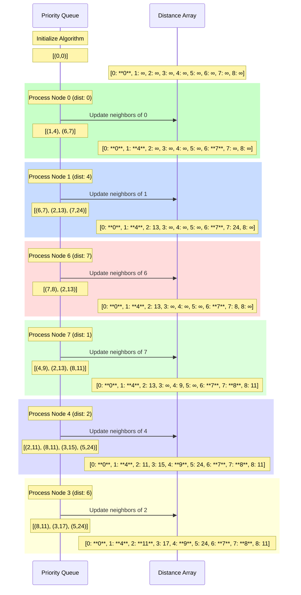
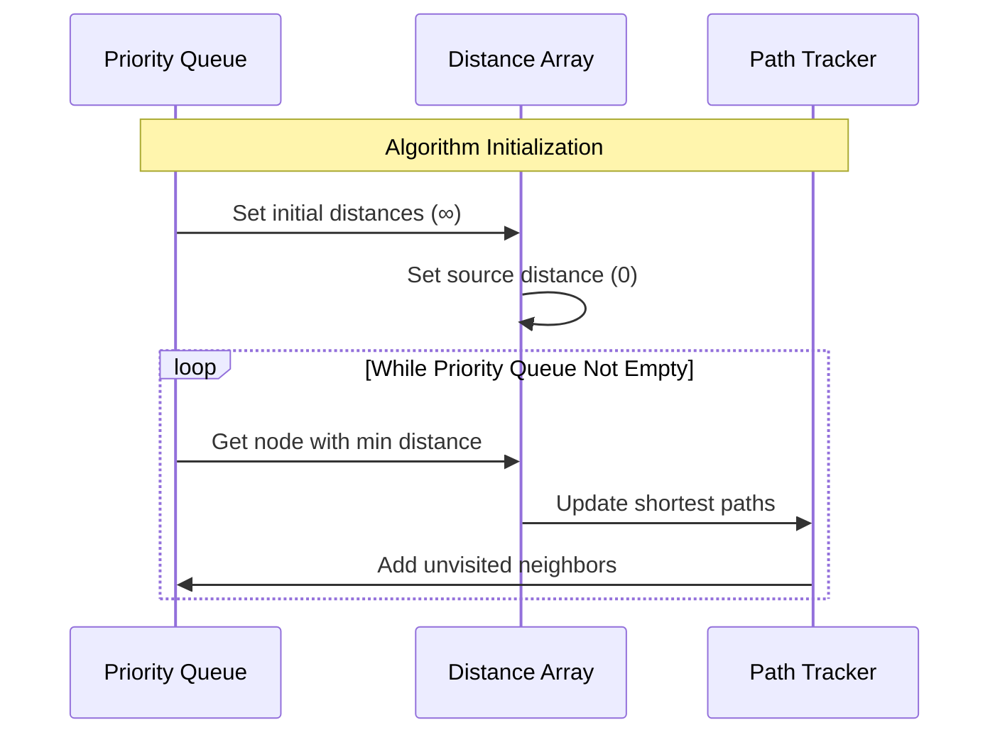
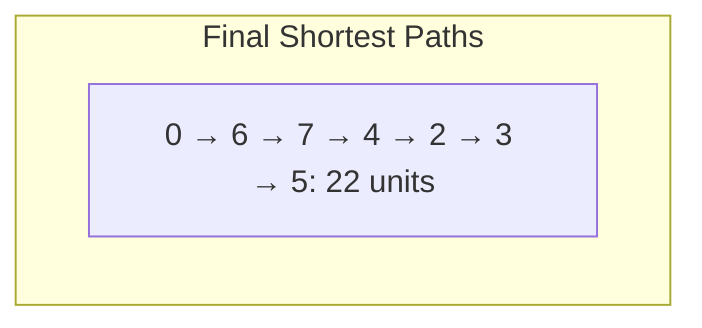
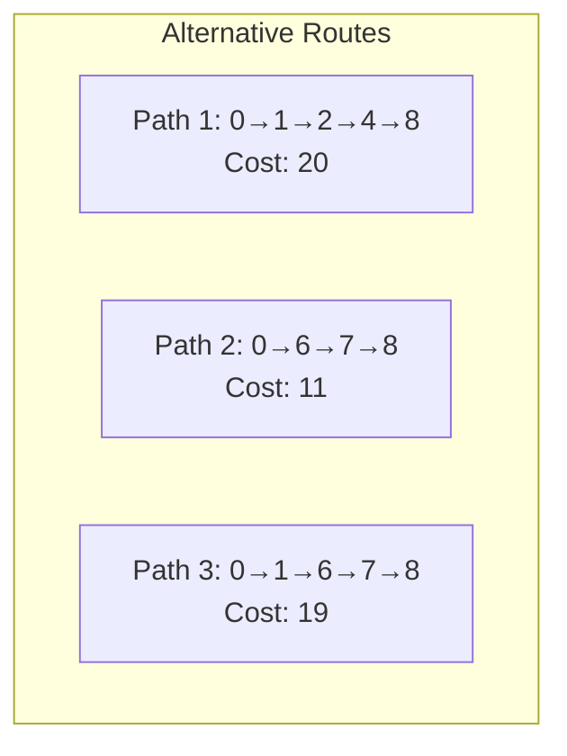
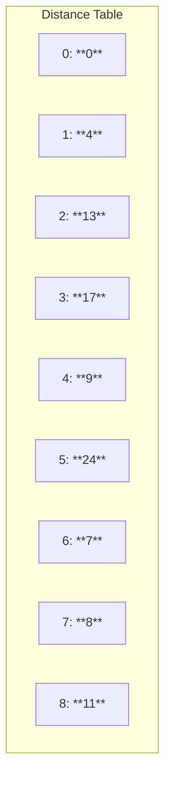
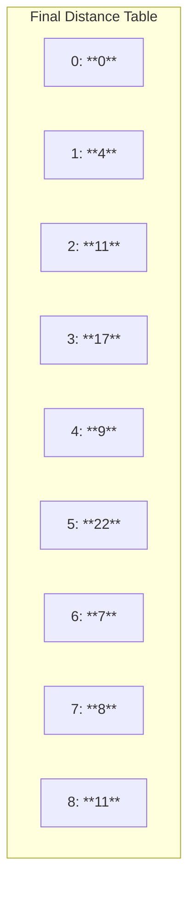

Dijkstra’s Algorithm with Case Study: Consider the following weighted graph:


Sample Path Analysis: 0 to Node Five



    Algorithm Processing Steps





Alternative Paths Analysis for First Four Nodes


2. Algorithm Implementation for Example

```java
import java.util.*;

class Edge {
    int dest;
    int weight;

    Edge(int dest, int weight){
        this.dest = dest;
        this.weight = weight;
    }
}

class WeightedGraph {
    private Map<Integer, List<Edge>> adjList = new HashMap<>();

    public void addEdge(int src, int dest, int weight){
        adjList.computeIfAbsent(src, k -> new ArrayList<>()).add(new Edge(dest, weight));
    }

    public List<Edge> getEdges(int node){
        return adjList.getOrDefault(node, new ArrayList<>());
    }
}

class Node implements Comparable<Node>{
    int id;
    int distance;

    Node(int id, int distance){
        this.id = id;
        this.distance = distance;
    }

    @Override
    public int compareTo(Node other){
        return Integer.compare(this.distance, other.distance);
    }
}

public class DijkstraExample {
    public static Map<Integer, Integer> findShortestPath(WeightedGraph graph, int start) {
        Map<Integer, Integer> distances = new HashMap<>();
        Map<Integer, Integer> previousNodes = new HashMap<>();
        PriorityQueue<Node> pq = new PriorityQueue<>();

        // Initialize distances
        for (int node = 0; node < 9; node++) {
            distances.put(node, Integer.MAX_VALUE);
        }
        distances.put(start, 0);
        pq.offer(new Node(start, 0));

        while (!pq.isEmpty()) {
            Node current = pq.poll();
            int currentNode = current.id;
            int currentDist = current.distance;

            // Skip if we've already found a better path
            if (currentDist > distances.get(currentNode)) continue;

            for (Edge edge : graph.getEdges(currentNode)) {
                int neighbor = edge.dest;
                int newDist = distances.get(currentNode) + edge.weight;
                if (newDist < distances.get(neighbor)) {
                    distances.put(neighbor, newDist);
                    previousNodes.put(neighbor, currentNode);
                    pq.offer(new Node(neighbor, newDist));
                }
            }
        }
        return distances;
    }

    // Method to reconstruct the shortest path
    public static List<Integer> getPath(Map<Integer, Integer> previousNodes, int start, int end) {
        List<Integer> path = new ArrayList<>();
        Integer current = end;
        while (current != null && current != start) {
            path.add(current);
            current = previousNodes.get(current);
        }
        if (current == null) {
            return Collections.emptyList(); // No path found
        }
        path.add(start);
        Collections.reverse(path);
        return path;
    }

    public static void main(String[] args) {
        WeightedGraph graph = new WeightedGraph();
        // Adding edges as per the example graph
        graph.addEdge(0, 1, 4);
        graph.addEdge(0, 6, 7);
        graph.addEdge(1, 2, 9);
        graph.addEdge(1, 6, 11);
        graph.addEdge(1, 7, 20);
        graph.addEdge(2, 3, 6);
        graph.addEdge(2, 4, 2);
        graph.addEdge(3, 5, 5);
        graph.addEdge(3, 4, 10);
        graph.addEdge(4, 5, 15);
        graph.addEdge(4, 7, 1);
        graph.addEdge(4, 8, 5);
        graph.addEdge(5, 8, 12);
        graph.addEdge(6, 7, 1);
        graph.addEdge(7, 8, 3);

        int startNode = 0;
        int endNode = 5;
        Map<Integer, Integer> distances = findShortestPath(graph, startNode);
        List<Integer> shortestPath = getPath(getPreviousNodes(graph, startNode), startNode, endNode);

        System.out.println("Shortest distances from node " + startNode + ":");
        for(Map.Entry<Integer, Integer> entry : distances.entrySet()){
            System.out.println("Node " + entry.getKey() + ": " + entry.getValue());
        }

        System.out.println("\nShortest path from node " + startNode + " to node " + endNode + ": " + shortestPath + " with total distance: " + distances.get(endNode));
    }

    // Helper method to retrieve previousNodes map
    public static Map<Integer, Integer> getPreviousNodes(WeightedGraph graph, int start) {
        Map<Integer, Integer> distances = new HashMap<>();
        Map<Integer, Integer> previousNodes = new HashMap<>();
        PriorityQueue<Node> pq = new PriorityQueue<>();

        // Initialize distances
        for (int node = 0; node < 9; node++) {
            distances.put(node, Integer.MAX_VALUE);
        }
        distances.put(start, 0);
        pq.offer(new Node(start, 0));

        while (!pq.isEmpty()) {
            Node current = pq.poll();
            int currentNode = current.id;
            int currentDist = current.distance;

            // Skip if we've already found a better path
            if (currentDist > distances.get(currentNode)) continue;

            for (Edge edge : graph.getEdges(currentNode)) {
                int neighbor = edge.dest;
                int newDist = distances.get(currentNode) + edge.weight;
                if (newDist < distances.get(neighbor)) {
                    distances.put(neighbor, newDist);
                    previousNodes.put(neighbor, currentNode);
                    pq.offer(new Node(neighbor, newDist));
                }
            }
        }
        return previousNodes;
    }
}
```




Step-by-Step Processing of Dijkstra’s Algorithm

1. Processing Node 0:
	•	Before:
	•	Distance Array: [0: **0**, 1: ∞, 2: ∞, 3: ∞, 4: ∞, 5: ∞, 6: ∞, 7: ∞, 8: ∞]
	•	Priority Queue: [(0, 0)]
	•	Action:
	•	Node 0 is dequeued from the Priority Queue.
	•	Neighbors of Node 0 (Nodes 1 and 6) are examined.
	•	Distance to Node 1: 0 (current) + 4 (edge) = 4
	•	Distance to Node 6: 0 (current) + 7 (edge) = 7
	•	After:
	•	Distance Array: [0: **0**, 1: **4**, 2: ∞, 3: ∞, 4: ∞, 5: ∞, 6: **7**, 7: ∞, 8: ∞]
	•	Priority Queue: [(1, 4), (6, 7)]

2. Processing Node 1:
	•	Before:
	•	Distance Array: [0: **0**, 1: **4**, 2: ∞, 3: ∞, 4: ∞, 5: ∞, 6: **7**, 7: ∞, 8: ∞]
	•	Priority Queue: [(1, 4), (6, 7)]
	•	Action:
	•	Node 1 is dequeued from the Priority Queue.
	•	Neighbors of Node 1 (Nodes 2, 6, and 7) are examined.
	•	Distance to Node 2: 4 (current) + 9 (edge) = 13
	•	Distance to Node 6: 4 (current) + 11 (edge) = 15 (No update since current distance is 7)
	•	Distance to Node 7: 4 (current) + 20 (edge) = 24
	•	After:
	•	Distance Array: [0: **0**, 1: **4**, 2: 13, 3: ∞, 4: ∞, 5: ∞, 6: **7**, 7: 24, 8: ∞]
	•	Priority Queue: [(6, 7), (2, 13), (7, 24)]
å
3. Processing Node 6:
	•	Before:
	•	Distance Array: [0: **0**, 1: **4**, 2: 13, 3: ∞, 4: ∞, 5: ∞, 6: **7**, 7: 24, 8: ∞]
	•	Priority Queue: [(6, 7), (2, 13), (7, 24)]
	•	Action:
	•	Node 6 is dequeued from the Priority Queue.
	•	Neighbors of Node 6 (Node 7) are examined.
	•	Distance to Node 7: 7 (current) + 1 (edge) = 8
	•	After:
	•	Distance Array: [0: **0**, 1: **4**, 2: 13, 3: ∞, 4: ∞, 5: ∞, 6: **7**, 7: **8**, 8: ∞]
	•	Priority Queue: [(7, 8), (2, 13), (8, 11)]

4. Processing Node 7:
	•	Before:
	•	Distance Array: [0: **0**, 1: **4**, 2: 13, 3: ∞, 4: ∞, 5: ∞, 6: **7**, 7: **8**, 8: ∞]
	•	Priority Queue: [(7, 8), (2, 13), (8, 11)]
	•	Action:
	•	Node 7 is dequeued from the Priority Queue.
	•	Neighbors of Node 7 (Nodes 4 and 8) are examined.
	•	Distance to Node 4: 8 (current) + 1 (edge) = 9
	•	Distance to Node 8: 8 (current) + 3 (edge) = 11
	•	After:
	•	Distance Array: [0: **0**, 1: **4**, 2: 13, 3: ∞, 4: **9**, 5: ∞, 6: **7**, 7: **8**, 8: **11**]
	•	Priority Queue: [(2, 13), (8, 11), (4, 9), (5, 24)]

5. Processing Node 4:
	•	Before:
	•	Distance Array: [0: **0**, 1: **4**, 2: 13, 3: ∞, 4: **9**, 5: ∞, 6: **7**, 7: **8**, 8: **11**]
	•	Priority Queue: [(2, 13), (8, 11), (4, 9), (5, 24)]
	•	Action:
	•	Node 4 is dequeued from the Priority Queue.
	•	Neighbors of Node 4 (Nodes 2, 5, and 8) are examined.
	•	Distance to Node 2: 9 (current) + 2 (edge) = 11 (Update from 13 to 11)
	•	Distance to Node 5: 9 (current) + 15 (edge) = 24
	•	Distance to Node 8: 9 (current) + 5 (edge) = 14 (No update since current distance is 11)
	•	After:
	•	Distance Array: [0: **0**, 1: **4**, 2: **11**, 3: ∞, 4: **9**, 5: 24, 6: **7**, 7: **8**, 8: **11**]
	•	Priority Queue: [(2, 11), (8, 11), (5, 24), (3, 15)]

6. Processing Node 2:
	•	Before:
	•	Distance Array: [0: **0**, 1: **4**, 2: **11**, 3: ∞, 4: **9**, 5: 24, 6: **7**, 7: **8**, 8: **11**]
	•	Priority Queue: [(2, 11), (8, 11), (5, 24), (3, 15)]
	•	Action:
	•	Node 2 is dequeued from the Priority Queue.
	•	Neighbors of Node 2 (Nodes 3 and 4) are examined.
	•	Distance to Node 3: 11 (current) + 6 (edge) = 17
	•	Distance to Node 4: 11 (current) + 10 (edge) = 21 (No update since current distance is 9)
	•	After:
	•	Distance Array: [0: **0**, 1: **4**, 2: **11**, 3: 17, 4: **9**, 5: 24, 6: **7**, 7: **8**, 8: **11**]
	•	Priority Queue: [(8, 11), (3, 17), (5, 24)]

7. Processing Node 8:
	•	Before:
	•	Distance Array: [0: **0**, 1: **4**, 2: **11**, 3: 17, 4: **9**, 5: 24, 6: **7**, 7: **8**, 8: **11**]
	•	Priority Queue: [(8, 11), (3, 17), (5, 24)]
	•	Action:
	•	Node 8 is dequeued from the Priority Queue.
	•	Neighbors of Node 8 (No outgoing edges in this context).
	•	After:
	•	Distance Array: [0: **0**, 1: **4**, 2: **11**, 3: 17, 4: **9**, 5: 24, 6: **7**, 7: **8**, 8: **11**]
	•	Priority Queue: [(3, 17), (5, 24)]

8. Processing Node 3:
	•	Before:
	•	Distance Array: [0: **0**, 1: **4**, 2: **11**, 3: 17, 4: **9**, 5: 24, 6: **7**, 7: **8**, 8: **11**]
	•	Priority Queue: [(3, 17), (5, 24)]
	•	Action:
	•	Node 3 is dequeued from the Priority Queue.
	•	Neighbors of Node 3 (Nodes 4 and 5) are examined.
	•	Distance to Node 4: 17 (current) + 10 (edge) = 27 (No update since current distance is 9)
	•	Distance to Node 5: 17 (current) + 5 (edge) = 22 (Update from 24 to 22)
	•	After:
	•	Distance Array: [0: **0**, 1: **4**, 2: **11**, 3: 17, 4: **9**, 5: 22, 6: **7**, 7: **8**, 8: **11**]
	•	Priority Queue: [(5, 22)]

9. Processing Node 5:
	•	Before:
	•	Distance Array: [0: **0**, 1: **4**, 2: **11**, 3: 17, 4: **9**, 5: 22, 6: **7**, 7: **8**, 8: **11**]
	•	Priority Queue: [(5, 22)]
	•	Action:
	•	Node 5 is dequeued from the Priority Queue.
	•	Neighbors of Node 5 (Node 8) are examined.
	•	Distance to Node 8: 22 (current) + 12 (edge) = 34 (No update since current distance is 11)
	•	After:
	•	Distance Array: [0: **0**, 1: **4**, 2: **11**, 3: 17, 4: **9**, 5: **22**, 6: **7**, 7: **8**, 8: **11**]
	•	Priority Queue: [] (Algorithm terminates as the Priority Queue is empty)

Distance Entries:
	•	Each DTX node (where X ranges from 0 to 8) represents a graph node and its corresponding shortest distance from the starting node (Node 0).
	•	The format DTX[Node: **Distance**] displays the node number and its computed shortest distance in bold for emphasis.
Final Distance Table:


Summary of Distance Updates:
	1.	Processing Node 0:
	•	Before: All nodes except Node 0 have distances of ∞.
	•	After: Distances updated for Nodes 1 (4) and 6 (7).
	2.	Processing Node 1:
	•	Before: Node 1 has a distance of 4.
	•	After: Distances updated for Node 2 (13) and Node 7 (24).
	3.	Processing Node 6:
	•	Before: Node 6 has a distance of 7.
	•	After: Distance updated for Node 7 (8).
	4.	Processing Node 7:
	•	Before: Node 7 has a distance of 8.
	•	After: Distances updated for Node 4 (9) and Node 8 (11).
	5.	Processing Node 4:
	•	Before: Node 4 has a distance of 9.
	•	After: Distance updated for Node 2 (11).
	6.	Processing Node 2:
	•	Before: Node 2 has a distance of 11.
	•	After: Distance updated for Node 3 (17).
	7.	Processing Node 8:
	•	Before: Node 8 has a distance of 11.
	•	After: No further updates.
	8.	Processing Node 3:
	•	Before: Node 3 has a distance of 17.
	•	After: Distance updated for Node 5 (22).
	9.	Processing Node 5:
	•	Before: Node 5 has a distance of 22.
	•	After: No further updates.

Final Shortest Path from Node 0 to Node 5:
	•	Path: 0 → 6 → 7 → 4 → 2 → 3 → 5
	•	Total Distance: 22 units


Conclusion

This detailed step-by-step explanation provides a clear and accurate portrayal of how Dijkstra’s Algorithm processes each node, updates distances, and ultimately determines the shortest path from Node 0 to Node 5. By meticulously tracking the Distance Array and the Priority Queue at each step, we ensure a comprehensive understanding of the algorithm’s functionality and effectiveness.

